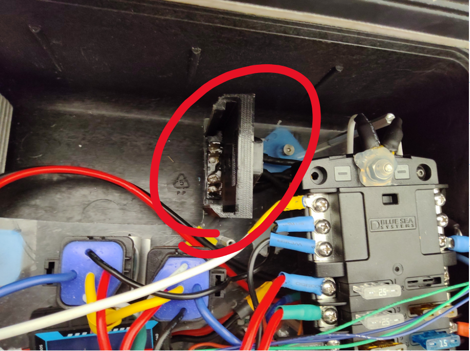
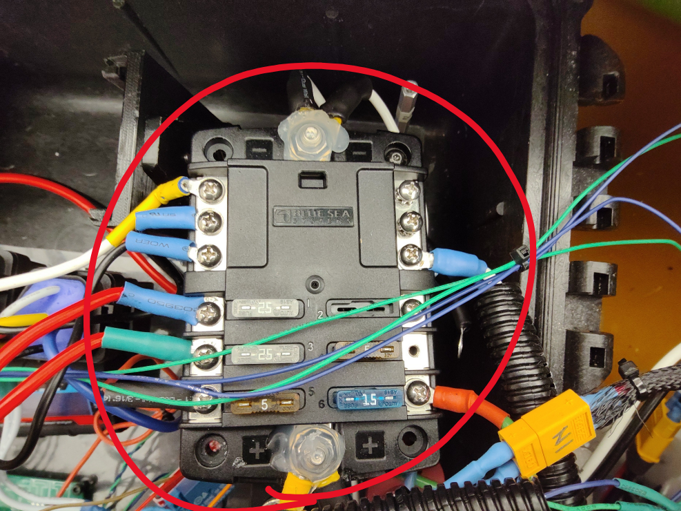
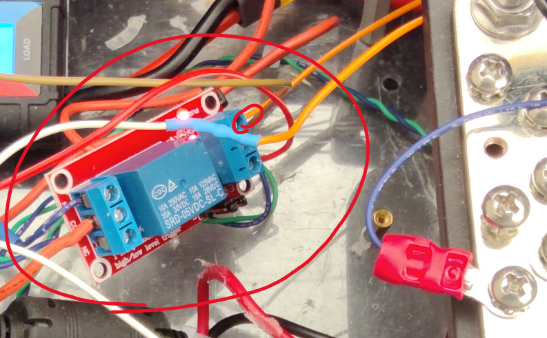

# RoboBoat Wiring

The Embry-Riddle RoboBoat Project produced a USV that shall henceforth be dubs the ERS Cyclone, or simply Cyclone.

### Power Input

The ERS Cyclone runs off of a 24 V Drill battery and connects to the rest of the system via two pairs of Positive (Red)
and Negative (Black) leads. Both pairs of these leads are run in parallel from the Drill Battery Holder to the [Blue 
Sea Systems 6 Circuit Fuse Block](https://www.bluesea.com/products/5025/ST_Blade_Fuse_Block_-_6).

An aspect of note for the connection is that one pair of these parallel leads is connector to a voltmeter and ammeter. 
It appears that this was done to monitor the voltage and current draw from the battery. However, because there are two 
parallel sets of leads, and the ammeter is only on one of the parallel leads, it does not give an accurate reading of 
the power and current draw. This is because the current will be divided across the two paths for current to flow based 
on resistance.

### Fuse Box

The ERS Cyclone passes all power through this fuse box before connecting to any of the electronics.

|  Circuit  | Circuit Load  | Current Limit |
|:---------:|:-------------:|:-------------:|
|     1     |    Relay 2    |     25 A      |
|     2     |               |               |
|     3     |    Relay 1    |     25 A      |
|     4     |               |               |
|     5     |               |               |
|     6     |               |               |

### Relay 1 & 2

| Color  | Function | Description                                 |
|:------:|:--------:|:--------------------------------------------|
|  Red   |  VCC_IN  | Power from the Fuse Box                     |
| Black  |  GND_IN  | Ground from the Fuse Box Common Ground      |
|  Blue  | VCC_OUT  | Power to the FWD ESC                        |
| Yellow | GND_OUT  | Ground (Open)                               |
| White  |   CTRL   | Actuator Signal from EStop and Relay Module |

### Relay Module

The relay module is part of the signaling circuit going to the Relay 1 & 2. The signaling circuit has two possible 
breaks, the first is from the hardware Emgerncy Stop Button on the outside of the hull, the second is this relay. 
This relay needs a signal from a low level processor, and that signal is delivered from the highlighted brown wire 
seen above.

