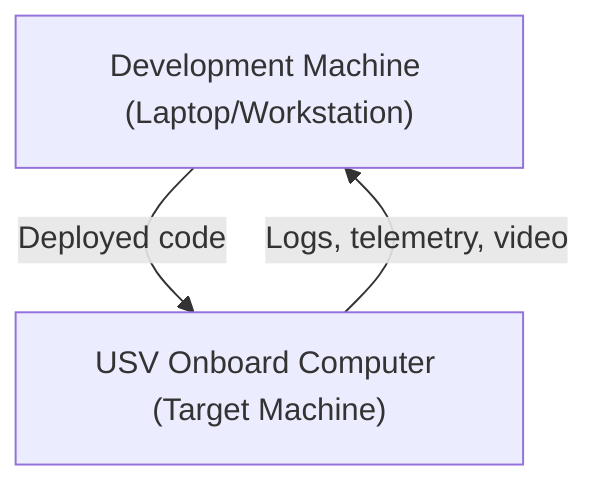

# Computers 101
***

In Robotics and Development, your computing hardware is a critical aspect to your systems. You are often working across 
multiple computers as part of a team, and often these computers work in entirely different ways. Each computer has its 
own purpose, advantages, and disadvantages. While not a comprehensive guide, this should help provide some context for 
the development process as we move forwards.

## The Roles

Computers often have different roles to play in the robotics process. The first roles we will discuss is that of the 
Development Machine.

### ***Development Machine*** - Your Laptop
> The computer where **software is written, compiled, and tested** during the development process. It typically runs
> developer tools such as an **IDE, compiler, debugger, and version control system**. The development machine is set up
> for **flexibility and debugging**, making it easier to modify code and simulate different environments.
>
> **Notes:**  
> • Often abbreviated as **Dev Machine**.

### ***Target Machine*** - Final Device
> The computer, hardware system, or embedded device where the **final application is deployed and executed**. Unlike
> the development machine, the target machine is typically the **intended operational environment** for the software
> and may have limited resources, specialized hardware, or a different operating system.
>
> **Notes:**  
> • Commonly used in **embedded systems, robotics, and cross-compilation** workflows.  
> • Examples: a microcontroller, a Raspberry Pi on a robot, or the onboard computer of an autonomous vehicle.  

***

## Architecture

### x86

**Overview**  
The modern x86 Architecture from Intel and AMD dominates desktops/workstations/servers.

**Strengths**
- **Peak performance & clocks**: High single-thread and multi-core performance available.
- **Mature ecosystem**: Broad OS/tooling support (Windows/Linux/BSD), drivers, commercial software, proprietary SDKs.
- **Greater compatibility**: Wide PCIe device support.
- **Virtualization**: Strong support for multi-VM for development and test environments.

**Limitations**
- **Power efficiency**: Generally lower performance-per-watt vs arm64 at similar throughput, important for battery bots.
- **Thermals/size**: Higher TDP; cooling & power delivery add mass/volume.

**Typical in Robotics**
- Dev laptops/workstations running ROS 2 builds, simulation (Gazebo/Ignition, Isaac Sim), heavy SLAM, training small models.
- High-end onboard computers where discrete GPUs are needed; industrial PCs.

**Notes for Senior Design Teams**
- If your toolchain requires x86-only binaries, prefer x86 on the dev machine and consider x86 target (NUC/Latte Panda) 
- to avoid cross-arch headaches. Or if limited experience with cross-platform development, consider x86 target as well.

---

### arm64

**Overview**  
RISC (Reduced Instruction Set Computing) 64-bit ARMv8+ ISA. Implemented by many vendors (e.g., Broadcom/Raspberry Pi, 
NVIDIA Jetson, Qualcomm, Ampere, Apple). Common in embedded/edge robotics.

**Strengths (Pros)**
- **Performance per watt**: Excellent energy efficiency; ideal for battery-powered robots and fanless builds.
- **Integrated SoCs**: On-die peripherals (CSI/ISP for cameras, GPU, NPU/DLA) reduce BOM and power.
- **Thermal footprint**: Lower TDP enables smaller enclosures and higher reliability in harsh environments.

**Limitations (Cons)**
- **Binary compatibility**: x86 binaries don’t run natively; requires rebuilds, emulation (QEMU), or multi-arch images.
- **Ecosystem gaps**: Some proprietary SDKs/drivers/tools remain x86-first; Windows-on-ARM is improving but still niche for robotics.
- **Peak single-thread**: At a given power budget, may trail the fastest x86 cores; matters for certain serial workloads.

**Typical in Robotics**
- Onboard compute for UAVs/UGVs/USVs (e.g., Raspberry Pi 4/5, NVIDIA Jetson series) running ROS 2 nodes, sensor drivers, and acceleration on integrated GPUs/NPUs.
- Edge AI deployments leveraging CUDA (Jetson) or vendor NPUs.

**Notes for Teams**
- Plan **cross-compilation** or **container multi-arch** (Docker buildx) from your x86 dev machine to arm64 target.

---

### Similarities vs. Differences (Quick View)

| Aspect | x86-64 | arm64 |
|---|---|---|
| ISA style | CISC with many legacy modes | RISC, cleaner decode |
| Power/Perf | Higher absolute peak; worse perf/W | Excellent perf/W; scales up to servers |
| Devices | Workstations, gaming laptops, servers | SBCs, embedded SoCs, laptops, servers |
| Vectors | SSE/AVX/AVX-512 (model‑dependent) | NEON; SVE on select cores |
| GPU Options | Broad discrete GPU support; CUDA on dGPUs | Jetson/CUDA on ARM; other NPUs vary by vendor |
| OS Support | Linux, Windows mature; wide driver base | Linux/Yocto/Ubuntu Server; Windows-on-ARM improving |
| Toolchains | GCC/Clang/MSVC; abundant prebuilts | GCC/Clang; many packages available, some need rebuild |
| Virtualization | Strong and mature (KVM/VT-x/AMD‑V) | Mature on servers (KVM/virt), lighter on SBCs |
| Determinism/RT | Similar with PREEMPT_RT; tuning required | Similar; lower TDP eases thermal throttling risk |

---

### Choosing for Robotics Projects

- **Pick x86** when you need: maximum compatibility with proprietary SDKs, highest single-thread speeds, discrete GPUs, or complex PCIe I/O cards. Great for dev work, simulation, CI, and heavy mapping/training.
- **Pick arm64** when you need: low power, integrated camera/GPU/NPU pipelines, small sealed enclosures, and long battery life. Ideal as the robot’s primary onboard computer.
- **Hybrid reality**: develop on x86 (fast compiles, simulation) and deploy to arm64 targets; standardize with Docker multi‑arch images and cross-compilation.

---

### Practical Tips (Teams)

- **Containers**: Use multi-arch Docker images (`--platform linux/amd64,linux/arm64`) to keep environments consistent.
- **Cross‑compile**: Toolchains like `aarch64-linux-gnu-g++` from x86; or use native builds on the arm64 device for kernel/driver work.
- **Emulation**: QEMU can run arm64 containers on x86 for testing; expect slower performance.
- **CI**: Add both amd64 and arm64 runners to catch arch-specific issues early.
- **SIMD guards**: Use runtime CPU feature checks (AVX/NEON) or compile-time flags per target.
- **Real‑time kernels**: Consider PREEMPT_RT for both archs if you need bounded latency.

---

### Disclaimer
Markdown formatting and copyediting done with the aid of OpenAI ChatGPT-5. Content was reviewed and curated by  
Tim Mascal, August 2025.

*Prepared by: Embry-Riddle Department of Mechanical Engineering*  
*Last Updated: October 2, 2025*  