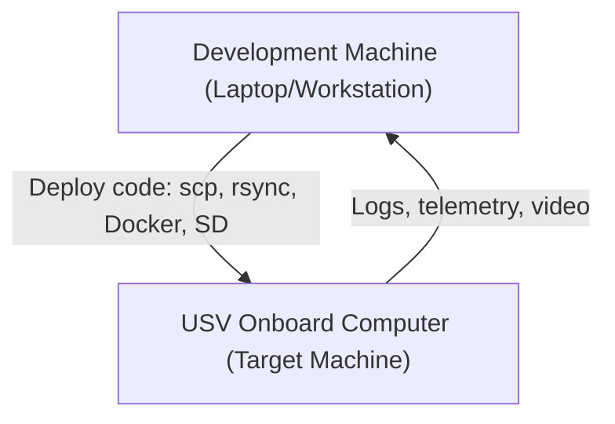

# Computers 101
***

In Robotics and Development, your computing hardware is a critical aspect to your systems. You are often working across 
multiple computers as part of a team, and often these computers work in entirely different ways. Each computer has its 
own purpose, advantages, and disadvantages. While not a comprehensive guide, this should help provide some context for 
the development process as we move forwards.

## The Roles

Computers often have different roles to play in the robotics process. The first roles we will discuss is that of the 
Development Machine.

### ***Development Machine*** - Your Laptop
> The computer where **software is written, compiled, and tested** during the development process. It typically runs
> developer tools such as an **IDE, compiler, debugger, and version control system**. The development machine is set up
> for **flexibility and debugging**, making it easier to modify code and simulate different environments.
>
> **Notes:**  
> • Often abbreviated as **Dev Machine**.

### ***Target Machine*** - Final Device
> The computer, hardware system, or embedded device where the **final application is deployed and executed**. Unlike
> the development machine, the target machine is typically the **intended operational environment** for the software
> and may have limited resources, specialized hardware, or a different operating system.
>
> **Notes:**  
> • Commonly used in **embedded systems, robotics, and cross-compilation** workflows.  
> • Examples: a microcontroller, a Raspberry Pi on a robot, or the onboard computer of an autonomous vehicle.  

***
## Architecture

### x86

### arm64

### Disclaimer
Markdown formatting and copyediting done with the aid of OpenAI ChatGPT-5. Content was reviewed and curated by  
Tim Mascal, August 2025.

*Prepared by: Embry-Riddle Department of Mechanical Engineering*  
*Last Updated: October 2, 2025*  