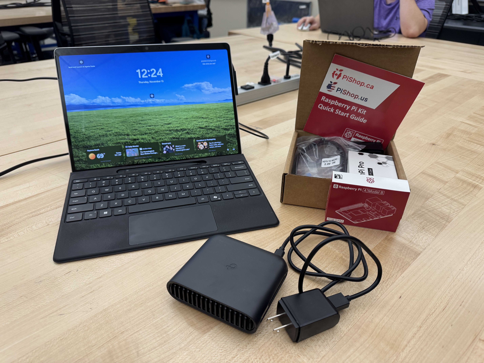
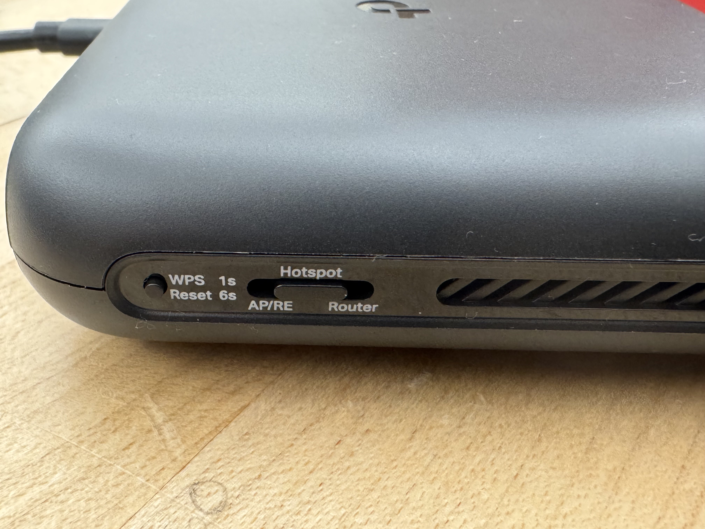
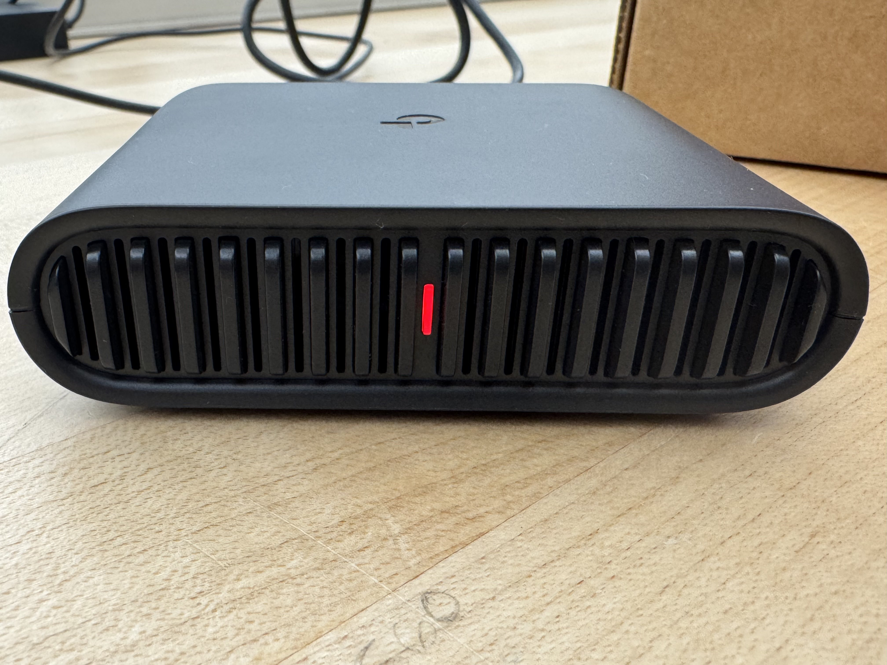
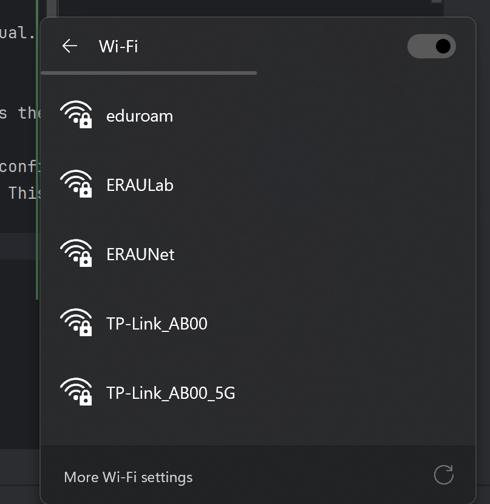
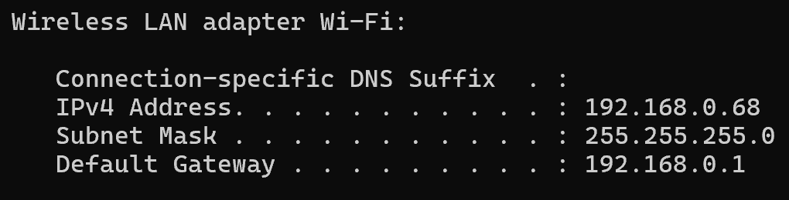
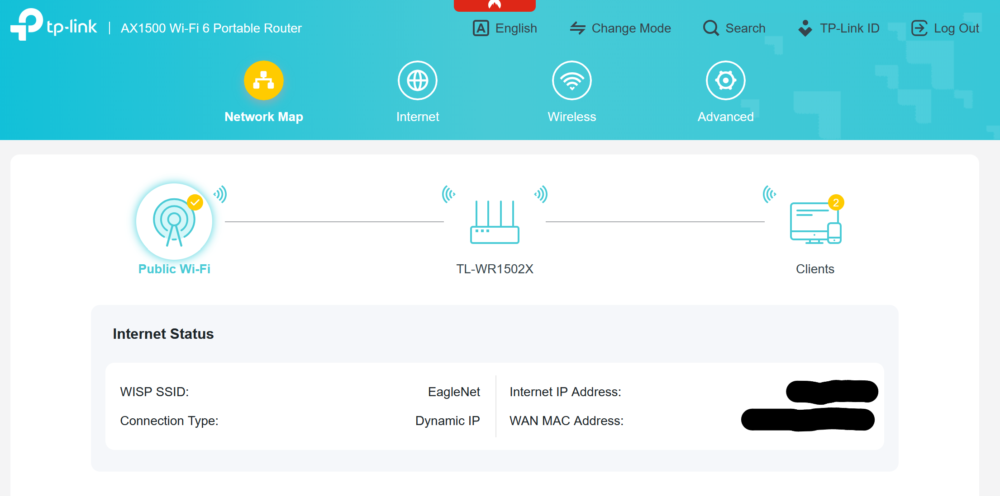
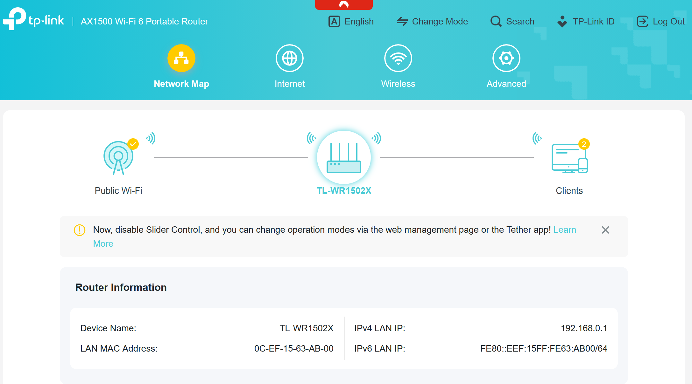
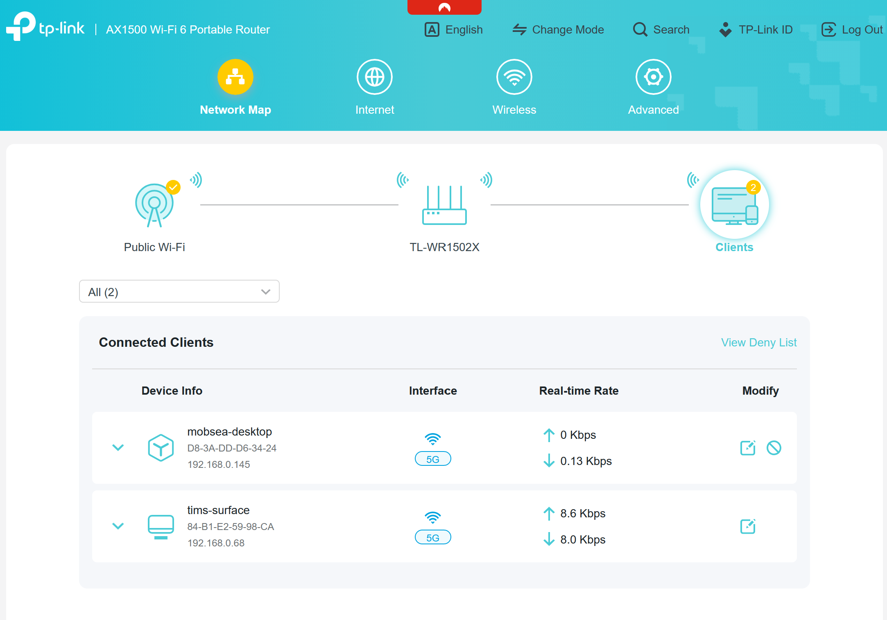
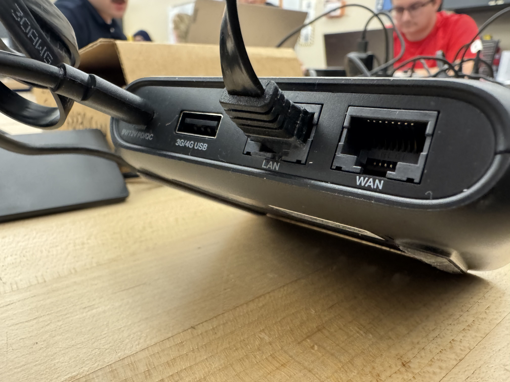
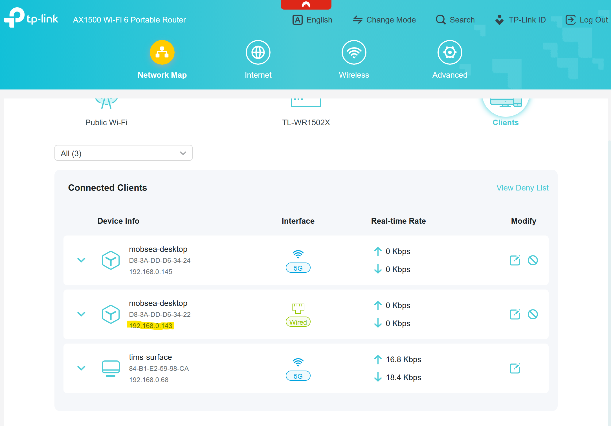

# Setting up a VSCode Server

## Materials
* A Computer running Windows.
* A raspberry pi, or another computer you will be developing on.
* A Travel Router.
* Optionally: Another regular Router if local traffic could overwhelm travel router bandwidth.

## Steps
### On your laptop, install VSCode
### Install Windows Subsystem for Linux, Ubuntu 22.04 for local development.
### Setup the Raspberry Pi with Ubuntu 22.04 and openssh-server

### Setup Travel Router



#### What is a Travel Router?
This Step will be documented with a TP-Link AX1500 Travel Router. The reference manual used can be found [here](https://static.tp-link.com/upload/manual/2025/202502/20250207/1910013612_TL-WR1502X%201.0_UG_REV1.0.0.pdf).
For the purposes of remote development of our robots, we will want to use this travel router as a "Hotspot". This will 
allow us to create a private network of devices, while still connecting to an external WiFi network (such as EagleNet). 
This is beneficial because we will have seamless access to all devices on our private Local Area Network (LAN), which 
enables SSH and the use of remote development tools, as well as still having access to the internet.

#### Setup of TP-Link AX1500 Travel Router
Remember, more details can be found inside the user manual linked above, or in your own travel router's user manual.

1. Use the switch on the side to put the router into HotSpot Mode.



2. Supply power to the Router, and wait until the indicator LED becomes solid red. This may take a few minutes as the 
router configures itself for the first time.

2. 

3. Optional: If this travel router is being reused, it may be necessary to perform a factory reset to erase the configuration 
from a previous user. This can be done by pressing and holding for 6 seconds until the indicator LED blinks red. This should
be done if the Router is not visible on your Laptops Wi-Fi.
4. Once the LED is solid red, you can connect the router Network via Wi-Fi or Ethernet. The password is found on the bottom of the router.



5. Login into Router Configuration Page. In this case, it has a domain name, [tplinkwifi.net](http://tplinkwifi.net/webpages/index.html#/)
For your router, the address can be found in the user manual, or you can use the default gateway of your device when 
connected to the router, as this should always direct you to your router configuration page.

```
# Windows
ipconfig

# Linux
route -n
```
These commands will show the default gateway on a windows or linux device.



Example of `ipconfig` output on Windows 11 cmd showing the default gateway `192.168.0.1`.

6. Inside the configuration page accessed through a web-browser with either the domain name or the default gateway, 
we can create our private LAN.



#### This page shows the public wifi configuration page. Connect it to one of the wifi networks that has internet access to give internet access to your LAN (Local Area Network).



#### This page shows the router configuration page. It has the details on passwords, and the image above shows the default gateway, aka the router's LAN ip address.



#### This page shows the clients on the network. This is useful if the ip address of your ssh server has changed due to dynamic ip assignment.


### Connect Raspberry Pi to Router
#### Method 1: Ethernet
1. Plug in the Raspberry Pi 4B to the Router's LAN Port using an Ethernet Cable. The model of router used in this 
tutorial automatically configured to connect wirelessly once it was plugged in. However, the next step will show you 
how to connect wirelessly once you plug in via ethernet for wireless development.




The indicator light should light up when a connection is established. It should be at least solid green to show it has a 
linked established. Blinking means data is being transferred.

2. To ssh into the Raspberry Pi, you will need the LAN ip address. This can be found in the Network Management Page of the Router.




#### Method 2: Wifi with `nmcli`

### SSH from Computer to Raspberry Pi
### Setup VSCode Server
### Install VSCode Server Client Extensions on Computer
