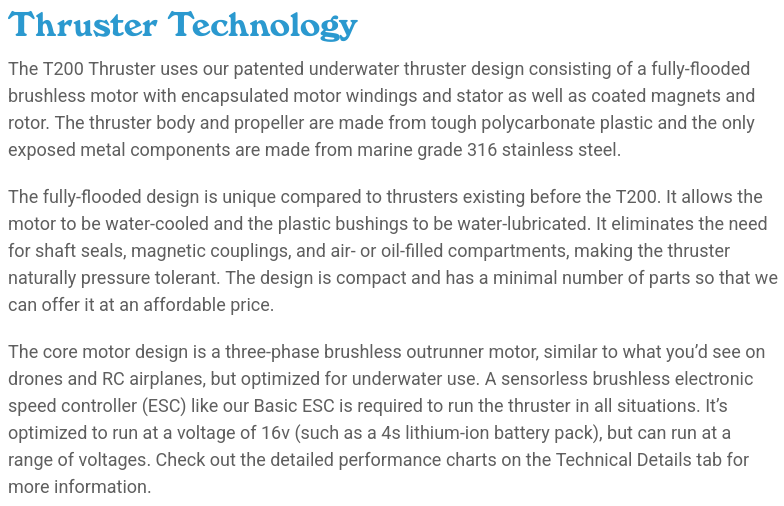

# Waterproofing 101
***

### Introduction

The purpose of this document is to provide insight on how to design components with water resistance in mind. It will 
cover how to think though designing around water hazards, and provide resources and suppliers who offer components that 
make waterproofing your vessel a breeze.

### Why is this important?

When working in any domain, our vessels are often at risk of exposing certain critical parts to contaminates from 
the environment. It is important to know what components are okay being exposed to those contaminates, which cannot be 
exposed, and protecting those components while still meeting requirements. Let's look over some examples of how we 
would know if a part needs extra protection:
***

## Common Suppliers for Components
### Blue Robotics
>Blue Robotics, Inc., specializes in low-cost, pressure-rated marine robotics components, including sensors, sonars, 
> thrusters, enclosures, and connectors. Their product line is widely used in marine robotics projects such as ROVs 
> and AUVs

#### Noteable Product: [WetLink Penetrators](https://bluerobotics.com/product-category/cables-connectors/penetrators/)

Blue Robotics and the surrounding community has a surplus of good information for surface and sub surface robotics.

### Blue Trail Engineering
> Blue Trail Engineering develops depth-rated waterproof servos, thrusters, and electrical connectors for marine 
> robotics and subsea applications. Their mission: to offer high-quality components meeting technical-spec standards at 
> more accessible price points for startups, academic teams, and research groups

#### Noteable Product: [Cobalt Connectors](https://www.bluetrailengineering.com/professional-products)

### Ocean Innovations
> Ocean Innovations, based in La Jolla, California, serves as a trusted distributor and integrator of advanced 
> underwater and oceanographic systems. They represent and supply products from leading manufacturers used by 
> researchers, commercial and military divers, hydrographic surveyors, and offshore engineers.

#### Noteable Product: [3M Underwater Splicing Kit](https://ocean-innovations.net/companies/3m-scotchcast-resinsplice-kits/)

### SeaCon
> Originally an independent brand, SEACON connectors are now part of TE Connectivity, offering extensive underwater 
> electrical and fiber-optic connector solutions for marine, ROV/AUV, subsea, oceanographic, and oil & gas applications.

#### Noteable Product: [WET‑CON Series (Wet-Pluggable Connectors)](https://www.te.com/en/products/connectors/intersection/wet-pluggable-connectors.html)

### SubConn
> SubConn® is an established brand within the MacArtney Underwater Technology Group, in operation since 1978. 
> The company specializes in rugged, wet-mateable and dry-mateable circular electrical connectors that are widely 
> used in marine, oceanographic, and offshore systems

#### Noteable Product: [SubConn Circular Series Connectors](https://www.macartney.com/connectivity/subconn/subconn-circular-series/)

### Pelican
> Established in 1976 and headquartered in Torrance, California, Pelican Products, Inc. is a global leader in rugged 
> protective solutions, best known for their durable, watertight cases and gear used across military, industrial, 
> marine, and consumer applications

#### Noteable Products: [Pelican Rugged Cases](https://www.pelican.com/us/en/products/cases/)

***
### T200 Motor Analysis
#### Step one: Proceed to the store or product page for your components. 
For the T200 Thruster from Blue Robotics, that can be found on the Blue Robotics Web Store. It looks something like 
this. 

#### Step two: Find the information you need. 
Most supplier store pages will have similar information, although the exact 
placement of things will be different. Sometimes the information you need is in an external documentation website 
(WaterLinked) or is in a pdf that you can download from the webpage (Mouser). Blue Robotics is an optimal scenario, 
where everything you need is available in great detail on the store page, and should be easy to find.

#### Step three: Determine what level this component can be exposed to the environment. 
In the case of the T200 Thruster, it can be intuitive to assume it is safe to be fully submerged in the water. If you 
weren't sure, you could read the store page.

The "Thruster Technology" part of the store page mentions things such as "fully flooded brushless motor" and 
"optimized for underwater use" that would tell you this motor is designed to be fully submerged in water. Further 
background knowledge such as the mention of Marine Grade 316 Stainless Steel would tell you is built to resist corrosion 
in environments such as salt water.

#### Step four: Make an Engineering Decision
Since the supplier provides information that tells us this product is intended to be used in an underwater environment, 
it likely has sufficient water proofing from the factory. If we were still unsure, many suppliers have a customer or 
engineering contact page. Where you could clarify any concerns you may have.
