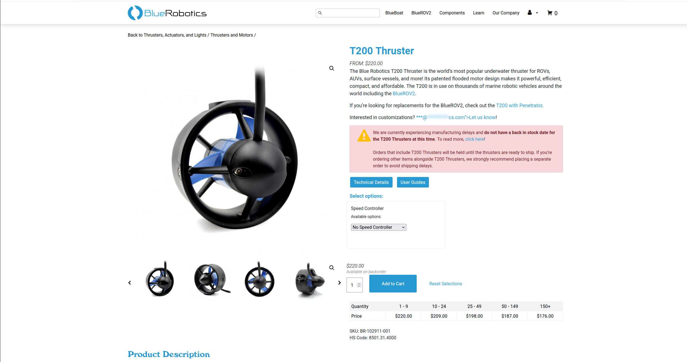

# Waterproofing 101
***

### Introduction

The purpose of this document is to provide insight on how to design components with water resistance in mind. It will 
cover how to think though designing around water hazards, and provide resources and suppliers who offer components that 
make waterproofing your vessel a breeze.

### Why is this important?

When working in any domain, our vessels are often at risk of exposing certain critical parts to contaminates from 
the environment. It is important to know what components are okay being exposed to those contaminates, which cannot be 
exposed, and protecting those components while still meeting requirements. Let's look over some examples of how we 
would know if a part needs extra protection:
***
#### T200 Motor
Step one: Proceed to the store or product page for your components. For the T200 Thruster from Blue Robotics, that can 
be found on the Blue Robotics Web Store. It looks something like this. Most supplier store pages will have similar 
information, although the exact placement of things will be different. Sometimes the information you need is in an 
external documentation website (WaterLinked) or is in a pdf that you can download from the webpage (Mouser). Blue 
Robotics is an optimal scenario, where everything you need is available in great detail on the store page, and should 
be easy to find.

